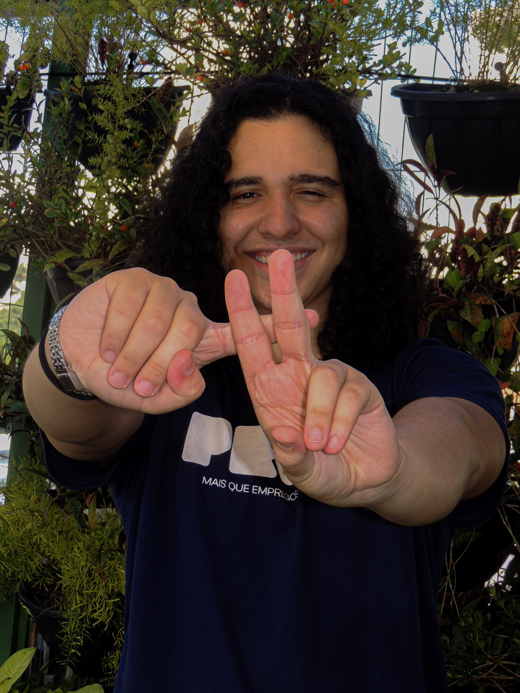
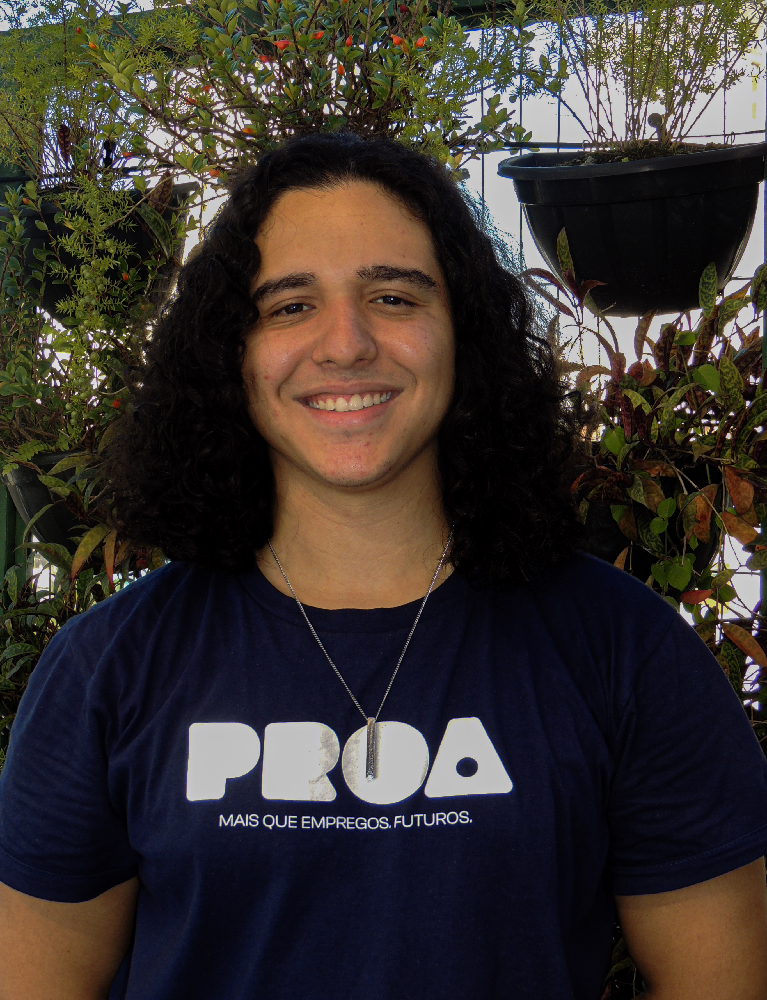

<div align="center">


<br>

#   Estudos PROA — Desenvolvimento Mobile

<br>

**Da lógica aos aplicativos: minha jornada completa no curso de Desenvolvimento Mobile do Instituto PROA.**

⏳ 6 meses de curso · 📱 Foco em mobile · 🎓 Formação 100% gratuita

</div>

---

## 👋 Olá! Bem-vindo(a) ao meu portfólio de estudos



Este repositório reúne todos os meus estudos, exercícios e projetos desenvolvidos durante o curso de **Desenvolvimento Mobile** do **Instituto PROA** — foram **6 meses** de aprendizado intensivo que me levaram dos fundamentos da lógica de programação até meus primeiros aplicativos Android e projetos com banco de dados.

Aqui você vai encontrar:

- 🧠 **Lógica**: algoritmos em Portugol e Kotlin;
- 📱 **Mobile**: aplicativos Android com Kotlin e Jetpack Compose;
- 🗄️ **Dados**: consultas, agregações e modelagem com MongoDB.

<br>

---

## 🏫 Sobre o curso e o Instituto PROA

O **Instituto PROA** é uma organização sem fins lucrativos que cria oportunidades de desenvolvimento pessoal e profissional para a inserção de jovens no mercado de trabalho de forma gratuita, capacitando jovens vindos de escolas públicas.

O curso de **Desenvolvimento Mobile** tem duração de **6 meses** e é 100% gratuito, abordando desde a lógica de programação até o desenvolvimento mobile e banco de dados, preparando os jovens para os desafios reais do mercado de tecnologia.

Dentro do instituto, a iniciativa **PROA Tech** conecta os jovens a profissionais da área de tecnologia, que compartilham suas trajetórias e experiências, inspirando e aproximando os alunos da realidade do mercado.

---

## 🗺️ Jornada de aprendizado

O repositório está organizado em **3 módulos** que acompanham a evolução do curso:

### 1️⃣ [Lógica de Programação](./1-Logica-de-Programacao)
A base de tudo: aprendendo a pensar como programador.

| Repositório | Conteúdo |
| --- | --- |
| 📁 [01-Estudos-Portugol](./1-Logica-de-Programacao/01-Estudos-Portugol) | Fundamentos, condicionais (SE/SENÃO), laços (ENQUANTO) e caixa eletrônico |
| 📁 [02-Estudos-Kotlin](./1-Logica-de-Programacao/02-Estudos-Kotlin) | IF/ELSE/WHEN, While/For, coleções, caixa eletrônico, hotel e POO |

### 2️⃣ [Android Studio](./2-Android-Studio)
A lógica ganhando vida na tela: meus primeiros apps Android.

| Repositório | Conteúdo |
| --- | --- |
| 📁 [01-EscolhaAleatoria](./2-Android-Studio/01-EscolhaAleatoria) | 🎲 App de sorteio com navegação entre telas e gerenciamento de estado |
| 📁 [02-ByteMelody](./2-Android-Studio/02-ByteMelody) | 🎵 App de integração de sons com MediaPlayer e ciclo de vida |

### 3️⃣ [Banco de Dados](./3-Banco-de-Dados)
O poder dos dados: consultas, análises e modelagem com MongoDB.

| Repositório | Conteúdo |
| --- | --- |
| 📁 [1.Oscar](./3-Banco-de-Dados/1.Oscar) | 🏆 Análise da base histórica do Oscar |
| 📁 [2.Momento](./3-Banco-de-Dados/2.Momento) | 🕐 Relatórios corporativos (RH, financeiro, vendas) |
| 📁 [3.Multiverso](./3-Banco-de-Dados/3.Multiverso) | 🌌 Higienização, normalização de dados e `$lookup` |

---

## 🛠️ Stack tecnológica

| Categoria | Tecnologias |
| --- | --- |
| 🧠 Lógica | Portugol Studio |
| 💻 Linguagem | Kotlin |
| 📱 Mobile | Android Studio, Jetpack Compose, Material 3 |
| 🗄️ Banco de dados | MongoDB (Shell / Compass) |
| 🐼 Análise de dados | Python + pandas |
| 🔧 Versionamento | Git & GitHub |

---

## 📈 Minha evolução

```
Portugol ──▶ Kotlin ──▶ Android/Compose ──▶ MongoDB
 (lógica)  (linguagem)    (mobile)          (dados)
```

---

## 🙏 Agradecimentos
<div align="center">


Agradecimento especial ao meu professor **Gabriel Augusto | @gabaugusto**, pela orientação, paciência e por transformar cada exercício em um passo rumo ao mercado de tecnologia.

E ao **Instituto PROA**, por proporcionar formação gratuita e de qualidade que transforma a vida de jovens. 💙

<br clear="left">

---

## ✍️ Autor

<div align="center">




**Herick Carvalho** — Estudante de Desenvolvimento Mobile no Instituto PROA
